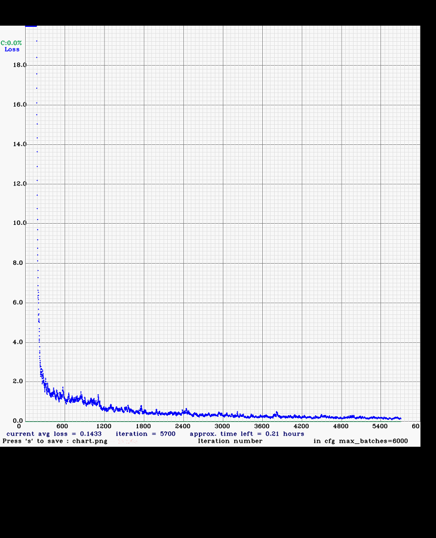

The preparation of the working dataset required the manual assisted annotation of the images that constituted the ground truth (GT) for the models. The images were annotated using standardized YOLO labeling format which was accomplished with the assistance of the open-source Labeling program (labelimg). The annotation process consisted of drawing boundary boxes around the image containing the object to be detected and the class of the object contained in each boundary box. In our case, objects such as guns, knives and bombs classes were used to simplify the analysis of the results. The input data for training the model using Keras required a specific input format. This format specification prepared by customized Python scripts relied on text files where the essential info was: the image file path, bounding boxes, and class id for the training data. 

